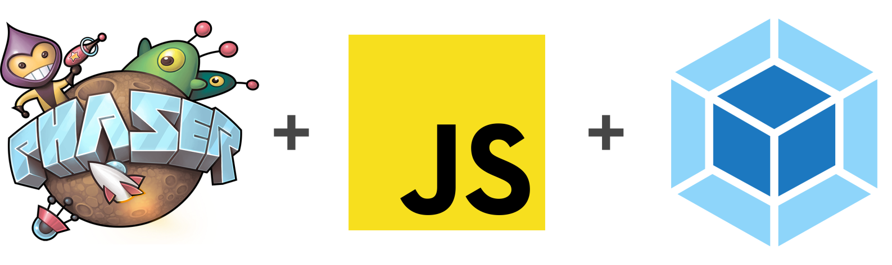

<h1 align="center">
   
  
   
  Phaser 3 Egg Game
   
</h1>

# Install dependencies
$ npm install

# Start the local development server (on port 8080)
$ npm start

# Ready for production?
# Build the production ready code to the /dist folder
$ npm run build
